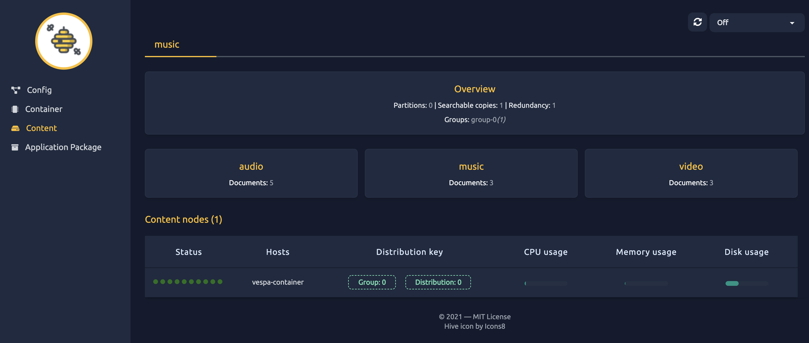

# Vispana

Vispana is a [Vespa.ai](https://vespa.ai/) web client tool designed to quickly understand the status of a cluster.



#### Contents

1. [Quickstart](#quickstart)
2. [Running Locally](#running-locally)
3. [Contributing](#contributing)
4. [Known Limitations](#known-limitations)

---

## Quickstart

Vispana is packaged in docker and available in [DockerHub](https://hub.docker.com/r/vispana/vispana).

To run, execute:
```shell
docker run --pull always -p 4000:4000 vispana/vispana
```

Access on: [http://localhost:4000](http://localhost:4000)

It will ask for the uri of a config-server in your cluster.

### Running Vespa locally on a Docker

If you are running Vespa locally in a Docker container, alongside Vispana, you need to make sure
that Vispana can access Vespa.

In a few steps, here's how to do it:

1. Create a docker network
    ```shell
      docker network create --driver bridge vespanet
    ```
2. Run Vespa within `vespanet` network and `vespa-container` hostname :
   ```shell
      docker run --detach --name vespa --network vespanet --hostname vespa-container --publish 8080:8080 --publish 19071:19071 vespaengine/vespa
    ```
3. Run Vispana within `vespanet` network:
    ```shell
      docker run -p 4000:4000 --network vespanet vispana/vispana:latest
    ```
4. Access Vispana in your browser via [http://localhost:4000](http://localhost:4000) and specify
   the config node as `http://vespa-container:19071` if you run vispana in docker. If you run 
   vispana locally, you can use `http://localhost:19071` or add `127.0.0.1 vespa-container` to 
   /etc/hosts.

5. Vispana assume that a application is running with name `default`.
   This project include a sample application that can be deployed to Vespa.
   See [SAMPLEAPP.md](https://github.com/vispana/vispana/blob/main/SAMPLEAPP.md) for more information.


## Running Locally

Set up your system using the [prerequisites](https://github.com/vispana/vispana/blob/main/CONTRIBUTING.md#prerequisites) section of `CONTRIBUTING.md`.

Then run the start script!

```shell
./start.sh
```

If you don't want to use the script, you can run the following command:

```shell
mvn spring-boot:run
```

## Contributing

We welcome your contributions through code, documentation, and bug reports!

Please see our [guidelines](./CONTRIBUTING.md) on how you can help.

## Known Limitations

- Accessing Vespa APIs with authentication is unsupported (i.e., Vespa Cloud is likely to not work).
